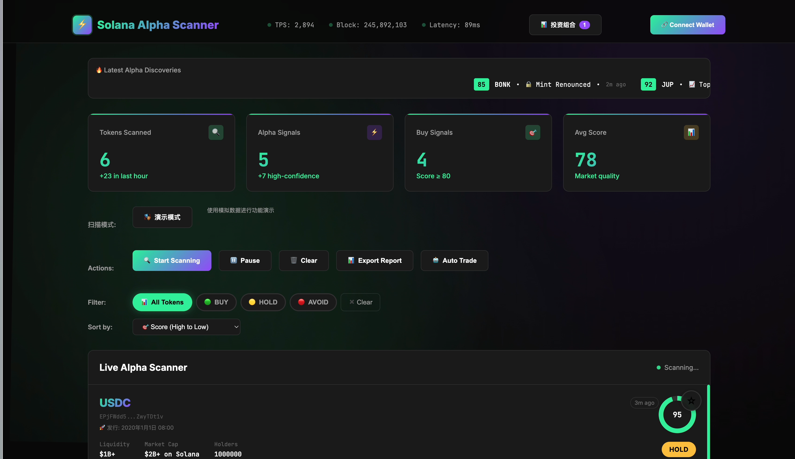
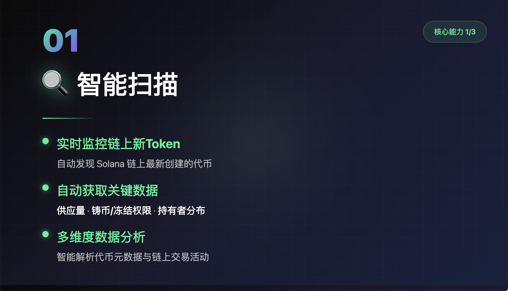
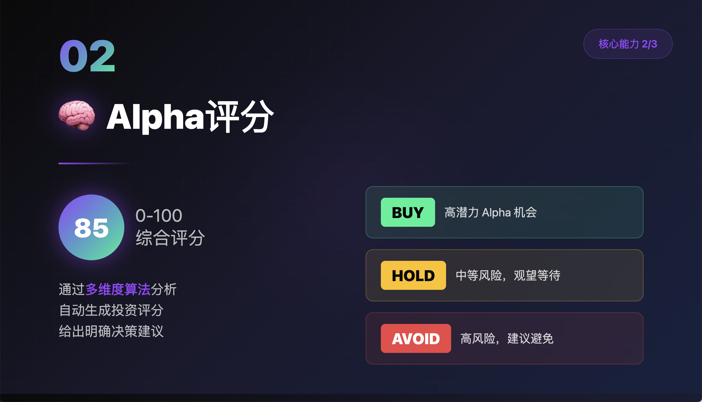
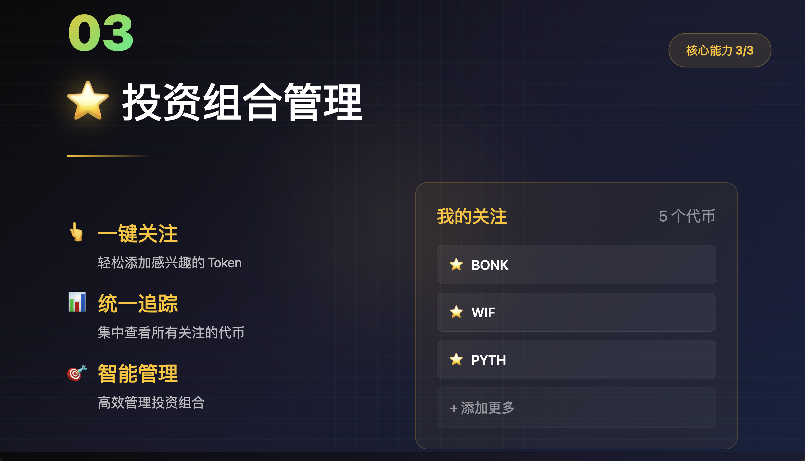

# 🚀 Solana Alpha Scanner

<div align="center">


**实时链上 Alpha 挖掘工具 | Real-time On-chain Alpha Discovery Tool**

[在线演示](https://hermygong.com/solana-scanner) | [视频介绍](#) | [黑客松项目](https://github.com/hermygong/Solana-Alpha-Scanner)

</div>

---

## 📖 项目简介

**Solana Alpha Scanner** 是一个纯前端的实时 Solana 链上 Token 扫描与分析工具，专为 Alpha 挖掘者打造。通过直接连接 Solana RPC 节点，实时监控新创建的 SPL Token，并提供智能评分和投资建议。

### 🎯 黑客松赛道
**Alpha 挖掘工具** - 帮助用户在 Solana 生态中发现早期投资机会

### ✨ 核心特性

#### 🔍 智能扫描
- ✅ 实时监控 Raydium、Pump.fun 等 DEX 的新 Token 创建
- ✅ 自动获取代币元数据（名称、符号、供应量）
- ✅ 分析持有者分布和权限状态（Mint/Freeze Authority）
- ✅ 顶部滚动 Ticker 实时展示最新 Alpha

#### 🧠 Alpha 评分系统
- **多维度算法分析**
  - 供应量评估（稀缺性）
  - 权限安全性检测
  - 持有者集中度分析
  - 流动性评估
- **0-100 分综合评分**
- **智能投资建议**
  - 🟢 **BUY**: 高潜力 Alpha 机会（80+ 分）
  - 🟡 **HOLD**: 中等风险，观望等待（50-79 分）
  - 🔴 **AVOID**: 高风险，建议避免（< 50 分）

#### ⭐ 投资组合管理
- 一键关注感兴趣的 Token
- 统一追踪所有关注的代币
- 本地持久化存储（LocalStorage）
- 导出投资组合报告（JSON）
- 组合统计：总数、信号分布、平均评分

#### 📊 多平台图表整合
- 点击 Token 卡片查看详细信息
- 集成主流 DEX 和分析平台：
  - [DexScreener](https://dexscreener.com)
  - [Birdeye](https://birdeye.so)
  - [Jupiter](https://jup.ag)
  - [Raydium](https://raydium.io)
- 直达项目官网、Twitter、Telegram

#### 🎨 Cyberpunk 可视化界面
- Solana 品牌色系（绿 #14F195 + 紫 #9945FF）
- 动态网格背景 + 光晕动画
- 响应式设计，支持移动端
- 暗色主题，护眼舒适

---

## 🚀 快速开始

### 在线使用
直接访问：[https://hermygong.com/solana-scanner](https://hermygong.com/solana-scanner)

### 本地部署

```bash
# 克隆项目
git clone https://github.com/hermygong/Solana-Alpha-Scanner.git
cd Solana-Alpha-Scanner

# 直接打开 index.html
# macOS
open index.html

# Linux
xdg-open index.html

# Windows
start index.html

# 或使用任意 HTTP 服务器
python3 -m http.server 8000
# 访问 http://localhost:8000
```

### 部署到 GitHub Pages

```bash
# 1. 推送代码到 GitHub
git add .
git commit -m "Initial commit"
git push origin main

# 2. 在 GitHub 仓库设置中：
#    Settings → Pages → Source: main branch → Save

# 3. 几分钟后访问：
#    https://your-username.github.io/Solana-Alpha-Scanner
```

---

## 💻 技术架构

### 技术栈
- **前端框架**: 纯原生 JavaScript（无框架依赖）
- **区块链交互**: [@solana/web3.js](https://solana-labs.github.io/solana-web3.js/)
- **钱包适配**: Phantom, Solflare, Backpack, OKX, Coinbase
- **数据存储**: LocalStorage
- **部署**: 静态网页（可部署到任意 CDN）

### 架构特点
✅ **纯前端应用** - 无需后端服务器  
✅ **零成本运行** - 使用公开 RPC 节点  
✅ **开箱即用** - 单文件 HTML，拷贝即可运行  
✅ **隐私保护** - 数据本地存储，不经过第三方服务器  

### RPC 节点配置
项目内置多节点容错机制，自动故障转移：
```javascript
const RPC_ENDPOINTS = [
    'https://api.mainnet-beta.solana.com',          // Solana 官方
    'https://solana-mainnet.rpc.extrnode.com',      // ExtrNode
    'https://ssc-dao.genesysgo.net',                // GenesysGo
    'https://solana.publicnode.com',                // PublicNode
];
```

> 💡 **生产环境建议**：注册专用 RPC 节点（[Helius](https://helius.dev) / [QuickNode](https://quicknode.com)），获得更高的速率限制和稳定性。

---

## 📸 项目截图

### 主界面


### 智能扫描


### Alpha 评分系统


### 投资组合管理


---

## 🎬 演示视频

查看完整功能演示：[项目演示视频]solana-alpha-scanner项目演示.mov

---

## 📂 项目结构

```
Solana-Alpha-Scanner/
├── index.html              # 主应用文件（单文件应用）
├── README.md               # 项目说明文档
├── LICENSE                 # MIT 许可证
├── .gitignore             # Git 忽略配置
├── docs/                   # 文档资源
│   ├── opening-frame.html          # 视频开场静帧
│   ├── slide-1-smart-scanning.html # 核心能力1展示页
│   ├── slide-2-alpha-scoring.html  # 核心能力2展示页
│   └── slide-3-portfolio.html      # 核心能力3展示页
└── assets/                 # 静态资源
    ├── 核心能力1.png
    ├── 核心能力2.png
    └── 核心能力3.png
```

---

## 🛠️ 使用指南

### 1️⃣ 连接钱包
点击右上角"连接钱包"按钮，选择你的 Solana 钱包（支持 Phantom、Solflare 等）

### 2️⃣ 切换扫描模式
- **演示模式**：使用模拟数据快速体验功能
- **真实模式**：连接 Solana 主网，扫描真实链上数据

### 3️⃣ 查看 Token 信息
- 在列表中浏览扫描到的 Token
- 查看评分、建议和风险信号
- 点击"查看图表"打开多平台分析链接

### 4️⃣ 管理投资组合
- 点击 Token 卡片右上角的 ⭐ 图标关注
- 点击顶部"投资组合"查看所有关注的代币
- 支持导出报告和一键清空

---

## 🔧 自定义配置

### 修改 RPC 节点
编辑 `index.html` 中的 `RPC_ENDPOINTS` 数组：
```javascript
const RPC_ENDPOINTS = [
    'YOUR_CUSTOM_RPC_URL',
    // ... 其他备用节点
];
```

### 调整扫描频率
修改 `scanSolanaTokens()` 的定时器间隔：
```javascript
realScanInterval = setInterval(() => {
    scanSolanaTokens();
}, 60000);  // 60秒，可根据需要调整
```

### 自定义评分算法
在 `analyzeTokenRisk()` 函数中修改评分逻辑。

---

## 🤝 贡献指南

欢迎提交 Issue 和 Pull Request！

### 开发流程
1. Fork 本仓库
2. 创建特性分支 (`git checkout -b feature/AmazingFeature`)
3. 提交更改 (`git commit -m 'Add some AmazingFeature'`)
4. 推送到分支 (`git push origin feature/AmazingFeature`)
5. 开启 Pull Request

### 待改进功能
- [ ] 添加更多 DEX 支持（Orca、Meteora 等）
- [ ] 集成 Pump.fun API
- [ ] 添加价格走势图表（集成 TradingView）
- [ ] 支持自定义评分权重
- [ ] 添加通知提醒功能
- [ ] 多语言支持（英文、日文等）

---

## 📜 许可证

本项目采用 [MIT License](./LICENSE) 开源协议。

---

## 👤 作者

**hermygong**

- GitHub: [@hermygong](https://github.com/hermygong)
- 个人网站: [https://hermygong.com](https://hermygong.com)

---

## 🙏 致谢

- [Solana](https://solana.com) - 高性能区块链平台
- [@solana/web3.js](https://github.com/solana-labs/solana-web3.js) - Solana JavaScript SDK
- [DexScreener](https://dexscreener.com) - DEX 数据聚合
- [Birdeye](https://birdeye.so) - Solana 数据分析平台

---

## ⚠️ 免责声明

本工具仅供学习和研究使用，不构成任何投资建议。加密货币投资存在高风险，请用户自行判断并承担投资风险。

---

<div align="center">

**如果这个项目对你有帮助，请给个 ⭐ Star！**

Made with ❤️ for Solana Community

</div>
